# ARCrender

寒假做的玩具光路追踪 ……

到时候用来交图形学作业吧 ～

## 一些结果：

两个球：

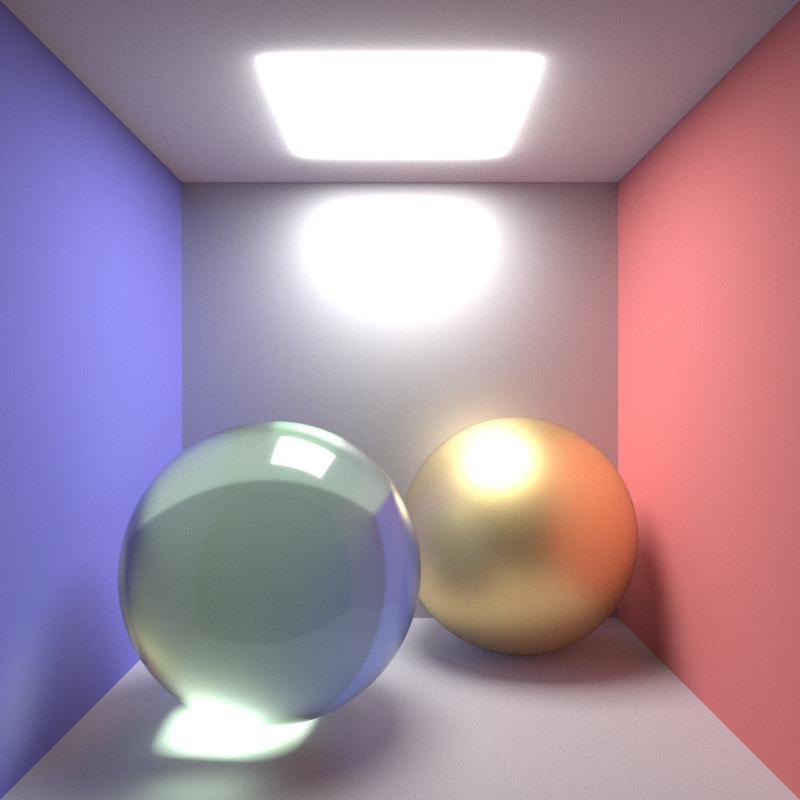</img>

经典模型 —— 茶壶：

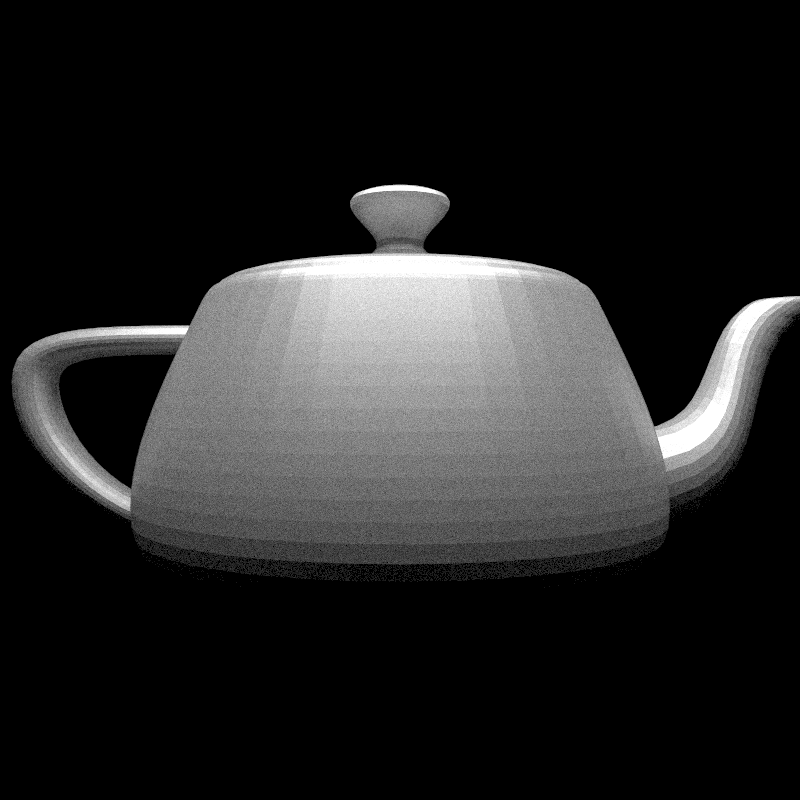</img>

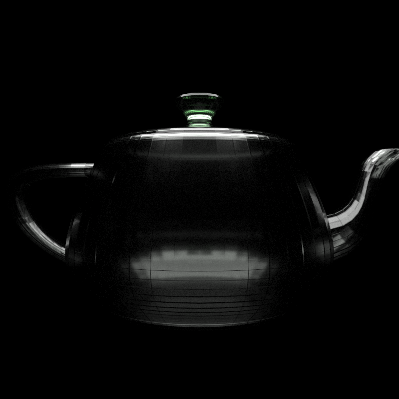</img>

我 minecraft 存档的外景 ：（种地穴居流

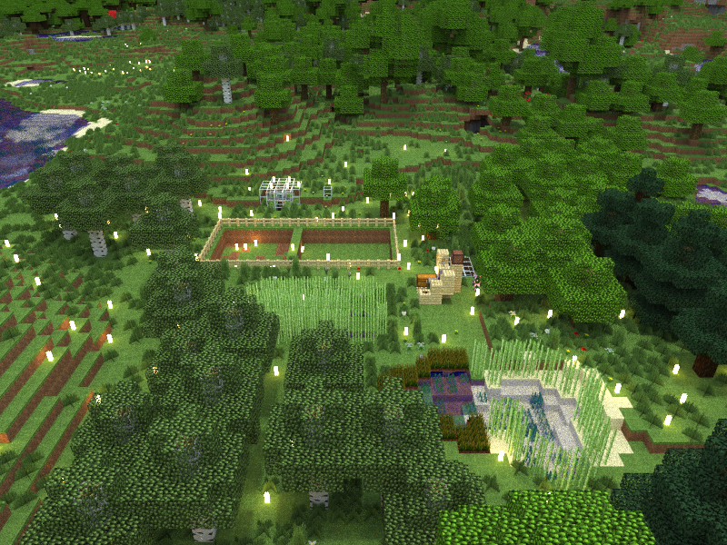</img>

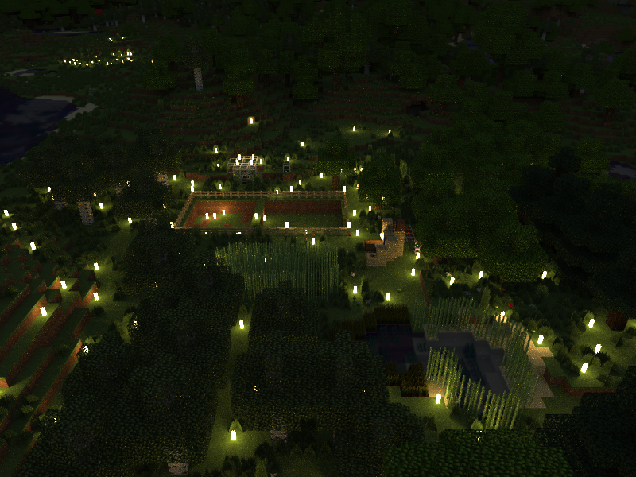</img>

网上拖的模型：

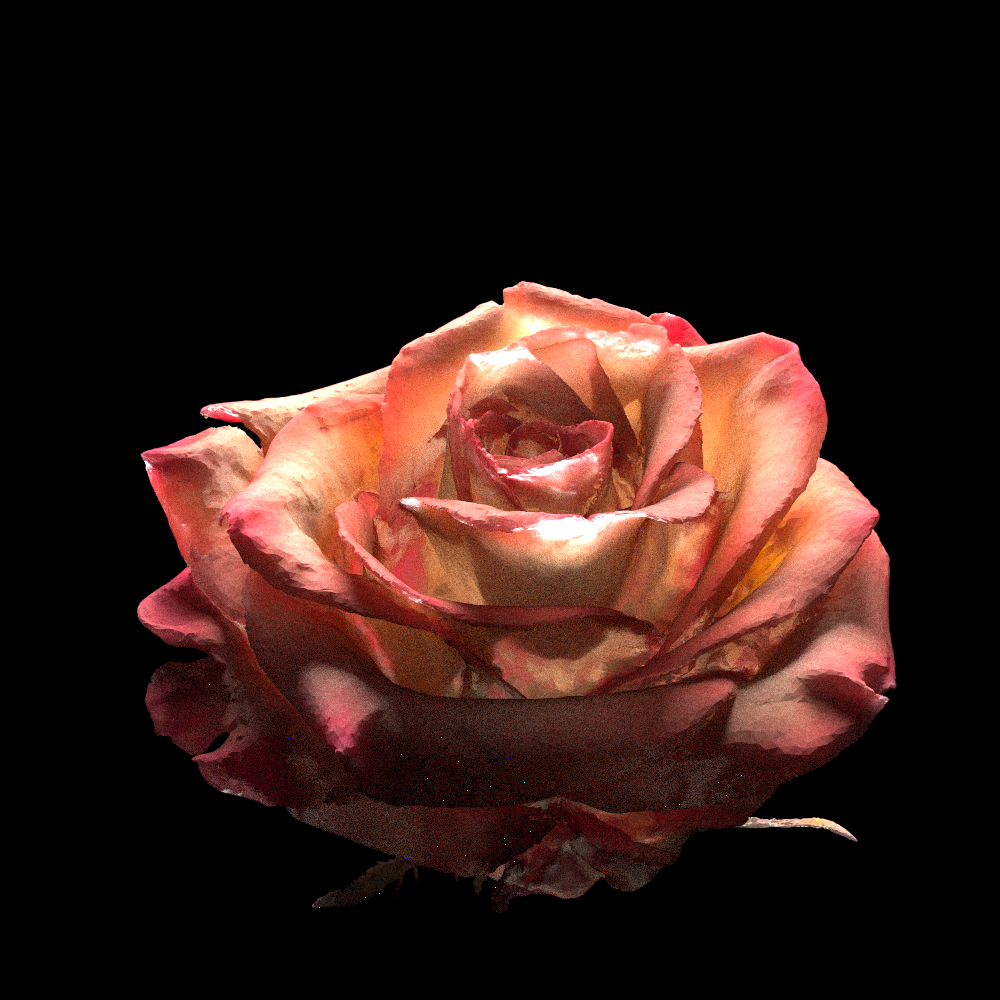</img>

### 材质的例子（spp 有点低，噪点有点多）

光滑的金属球：

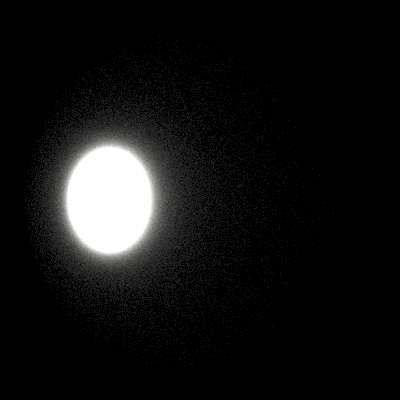</img>

粗糙的金属球：

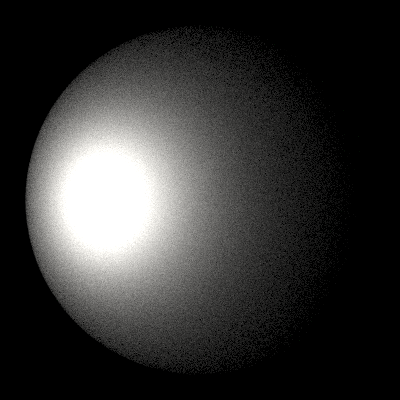</img>

光滑的塑料球：

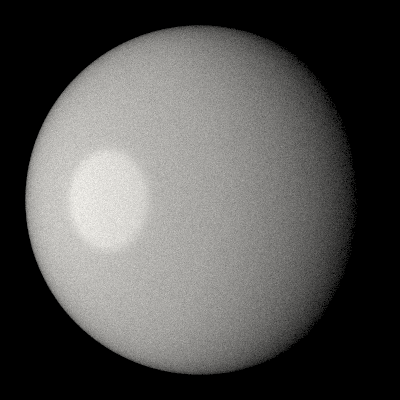</img>

粗糙的塑料球：

</img>

光滑的绿宝石球：

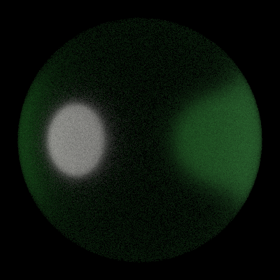</img>

粗糙的绿宝石球：

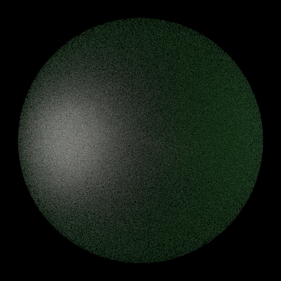</img>

不是很懂是什么球：

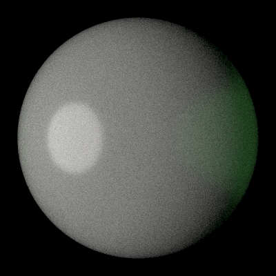</img>

## 想写的东西：
- [x] BRDF
- [x] BSDF (现在用的是参考 disney 的 GGX )
- [x] pbr 材质 （参数是 ior, trans-rate 和 roughness，不知道靠不靠谱 …… ）
- [x] 贴图导入
- [x] mtl 材质 （不太全，能用就行 X）
- [x] 模型导入 （暂未处理法向量）
- [ ] BSSDF
- [ ] 双向光路追踪
- [ ] 实时光路追踪（嘛，就整个UI吧）
- [ ] 还 没 完 。 。 。
